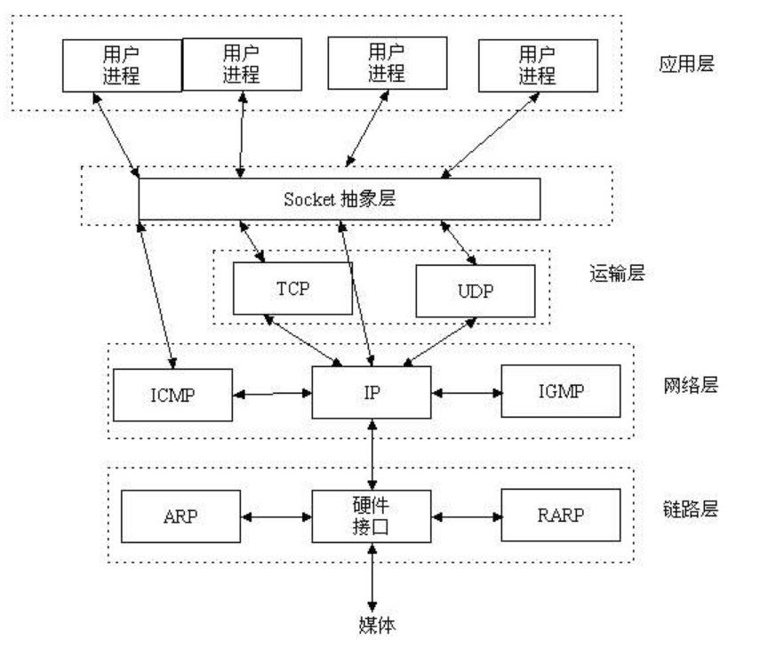
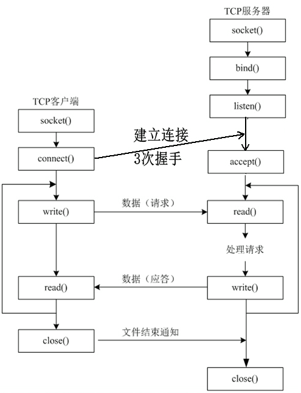

## 网络编程和Socket概要

**网络编程**就是编写程序使两台联网的计算机相互交换数据。

我们知道两个进程间想通信，前提是能找到对方(进程需要有唯一的标识)。在Linux系统中我们使用PID来唯一标识一个进程。但是PID只是在本地唯一，在网络中PID冲突的几率很大，我们需要提供另一种能唯一标识网络中不同进程的方式。我们知道IP层的IP地址可以唯一标识一台主机，而TCP层协议和端口号可以唯一标识主机中的一个进程。所以可以通过`IP地址 + 协议 + 端口`来唯一标识网络中的一个进程。这样就可以通过使用`socket`完成两个网络进程的通信.

**Socket**由操作系统提供的网络数据传输接口。可以理解为`Socket`是应用层和传输层之间的一个抽象层，将TCP/IP层复杂的操作抽象成几个简单的接口供应用层调用，以实现进程在网络中的通信。

`socket`起源于`Unix`，在`Unix`一切皆文件的思想下，`socket`也是一种文件，遵循`打开-读/写-关闭`的模式。服务器端和客户端各自维护一个`socket`文件，在建立连接之后，可以向自己的文件中写入数据供对方读取，或者读取对方内容，通信结束时关闭`socket`文件。

### Socket的类型

### 服务器端socket(接受连接请求)

服务器socket又称监听(listening)socket。创建过程如下：

1. 调用`socket()`函数创建套接字；
2. 调用`bind()`函数分配IP地址和端口号；
3. 调用`listen()`函数转为可接收请求状态；
4. 调用`accept()`函数处理连接请求。

### 客户端socket(请求连接)

创建过程如下：

1. 调用`socket()`函数创建套接字；
2. 调用`connect()`函数向服务器端发送连接请求。

### 补充：基于Linux的文件操作

上面说到过，Unix和Linux下“一切皆文件”的思想。对于Linux而言，socket操作和文件操作没有区别，所以在网络数据传输过程中可以使用文件I/O的相关函数。但是对于Windows来说，是区分socket和文件的，所以在Windows中要调用特殊的数据传输相关函数。

#### 文件描述符(File Descriptor)

文件描述符是操作系统分配给文件或者socket的整数。程序通过文件描述符操作文件和socket。在Linux中常用的3个文件描述符：

|文件描述符|对象|
|:---:|:---|
|0|标准输入: Standard Input|
|1|标准输出: Standard Output|
|2|标准错误: Standard Error|

### 补充：以`_t`为后缀的数据类型

在`sys/types.h`文件中使用`typedef`定义了很多新的基本数据类型别名。例如： `size_t`、`ssize_t`等。

原因：目前主流操作系统和计算机的`int`是32位的。而在过去16位操作系统的年代，`int`类型是16位的。根据系统的不同，数据类型的表示形式随之变化，需要修改程序中使用的数据类型。如果在之前已在需要声明4字节数据类型之处使用了`size_t`或者`ssize_t`，则将大大减少代码的变动，因为只需要修改并编译`size_t`或者`ssize_t`的`typedef`声明即可。为了与程序员定义的新数据类型加以区分，操作系统定义的数据类型会添加后缀`_t`。

### 补充： TCP网络编程中`connect`, `listen`, `accpet`三者之间的关系

基于TCP的网络开发中服务器端和客户端核心步骤如下:

#### 服务器端

`listen`函数: 非阻塞, 将套接字转为可接收请求状态,并将套接字和套接字对应的连接队列长度(由backlog参数指定)通知Linux内核.

`accept`函数: 处理已经建立连接的请求.

##### 三次握手的连接队列

内核会为每个处于可接收请求状态的socket维护两个队列:

1. **未完成连接队列(Inccompelete connection queue)**

客户发出的请求已经到达服务器, 而服务器正在等待完成相应的TCP三次握手过程.这些socket处于`SYC_RCVD`状态

2. **已完成连接队列(compeleted connection queue)**

已完成TCP三次握手过程.这些socket处于`ESTABLISHED`状态

#### 客户端

`connect`函数: 客户端主动连接socket服务器，Linux内核完成TCP三次握手，然后将连接结果返回给`connect`函数。

### 参考连接

[简单理解Socket](https://www.cnblogs.com/dolphinX/p/3460545.html)
[Linux网络编程——浅谈 TCP 三次握手和四次挥手](https://blog.csdn.net/tennysonsky/article/details/45622395)
[TCP 通信过程中各步骤的状态](https://blog.csdn.net/tennysonsky/article/details/45646561)
[TCP网络编程中connect()、listen()和accept()三者之间的关系](https://blog.csdn.net/tennysonsky/article/details/45621341)

### 习题

1. Socket在网络编程中的作用是什么?为何称为套接字?

Socket是由操作系统提供的网络通信接口,将TCP/IP层复杂的操作封装成几个简单的接口供应用层调用,实现网络进程间的通信.(可以理解成Socket是应用层和传输层间的一个抽象层.)

2. 在服务器端创建套接字之后,会依次调用`listen`函数和`accept`函数.请比较说明两者作用.

`listen`函数将套接字变成被动连接监听套接字(将socket转为可接收请求状态),并将套接字和套接字对应的连接队列长度告诉Linux内核.非阻塞

`accept`函数从处于`ESTABLISHED`状态的连接队列头部取出一个链接,处理连接请求.如果这个队列没有链接,`accept`函数会一直阻塞,等待链接的到来.

3. Linux中,对套接字数据进行I/O时可以直接使用文件I/O相关函数;而在windows中则不可以,为何?

在Linux中，**一切皆文件**，即socket也是一个文件，所以socket的操作和文件的操作没有区别，都遵循`打开-读/写-关闭`的模式。而在windows中，socket和文件是不一样的东西，需要使用特定的操作。

4. 创建套接字一般会给它分配地址,为什么?为了完成地址分配需要调用那个函数?

为客户端提供连接地址，标识服务器socket。调用`bind`函数。

`bind`函数可以指定特定IP的客户端才能连接。

5. 底层文件I/O函数与ANSI标准定义的文件I/O函数之间有什么区别?

底层文件I/O是指操作系统提供的基本I/O服务。又称低级磁盘I/O，遵循POSIX相关标准。任何兼容POSIX标准的操作系统上都支持文件I/O。

标准I/O被称为高级磁盘I/O，遵循ANSI C相关标准。只要开发环境中有标准I/O库，标准I/O就可以使用。 具备可移植性。

