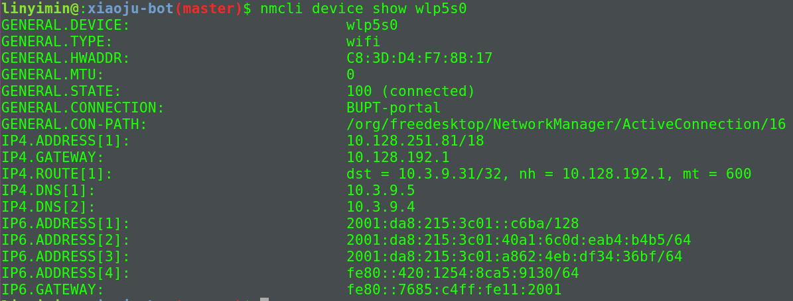

## 域名及网络地址

### 域名系统(DNS)

> DNS是对IP地址和域名进行相互转换的系统, 其核心是DNS服务器.

### 域名记录类型

- A记录: 子域名对应的目标主机地址.
- MX记录: 

### 域名解析过程

当在浏览器中输入相关网址时, DNS解析将会有将近10步骤, 如下图:


其中前两个步骤在本机完成, 后8个步骤才涉及到真正的域名解析服务器.

1. 浏览器首先检查缓存中是否存在域名对应的的IP地址,如果存在,则解析结束.如果不存在, 或者缓存过期,则进行第二步.
2. 浏览器会在操作系统缓存中查找域名对应的DNS解析结果.操作系统通过读取hosts文件实现域名解析.
3. 若1,2步解析失败,则需要DNS服务器进行解析.操作系统会将要解析的域名发送给本地域名服务器(LDNS).这个专门的域名解析服务器性能很好, 也会缓存域名解析结果.大约80%的域名解析在这里结束.
4. 如果LDNS也没有解析成功, 则LDNS直接向Root Server(根域名服务器)发送DNS请求.
5. Root Server(根域名服务器)返回一个主域名服务器(gTLD Server)域名.gTLD是国际顶级域名(全球一共13个域名)
6. LDNS向gLTD发送DNS请求
7. 接受请求的gLTD返回域名对应的Name Server域名服务器域名(用户注册的域名服务器), 例如用户在某个域名服务提供商申请的域名，那么这个域名解析任务就由这个域名提供商的服务器来完成
8. LDNS向Name Server发送DNS请求
9. Name Server查询存储的域名和IP映射表, 得到域名对应的IP, 连同一个TTL值返回给LDNS
10. LDNS缓存结果,并返回给用户, 域名解析结束.

根据上面的流程,我们可以知道DNS服务器根据域名的层级,进行分级查询.

<font color="#dd0000">每一级域名都有自己的NS(Name Server)记录, NS记录指向该级域名的域名服务器, 这些服务器知道下一级域名的各种记录</font>

所以分级查询就是:

<pre>
1. 从"根域名服务器"查到"顶级域名服务器"的NS记录和A记录(IP地址)
2. 从"顶级域名服务器"查到"次级域名服务器"的NS记录和A记录(IP地址)
3. 从"次级域名服务器"查到"主机名"
</pre>

### Ubuntu获取本地DNS服务器地址

```shell
$ nmcli device show <interfacename>
```



### 查询过程

使用命令`dig`显示整个查询过程

### 参考链接

[DNS域名解析过程](https://www.cnblogs.com/xrq730/p/4931418.html)
